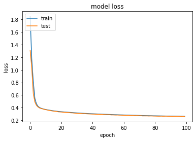
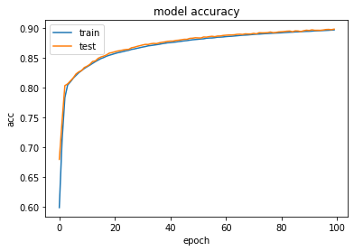

# CNN+LSTM model for image to svg code prediction

# Goal 
The goal is to learn to generate the Scalable Vector Graphics (SVG) code
correspondig to images of simple colored shapes. SVG is a markup language
which is used to define vector graphics.

# Example

## Image 


## Scalable Vector Graphics (SVG) code

```
<?xml version="1.0" encoding="utf-8" ?>
<svg baseProfile="full" height="64" version="1.1" width="64" xmlns="http://www.w3.org/2000/svg" xmlns:ev="http://www.w3.org/2001/xml-events" xmlns:xlink="http://www.w3.org/1999/xlink"><defs /><ellipse cx="32.0" cy="8.0" fill="silver" rx="16.0" ry="16.0" /><ellipse cx="32.0" cy="56.0" fill="green" rx="32.0" ry="16.0" /><ellipse cx="8.0" cy="8.0" fill="green" rx="16.0" ry="32.0" /></svg>
```
## Requirements

• tensorflow\
• keras\
• pillow\
• numpy

or run below code in your prompt window after git cloning this repository

```
pip install -r requirements.txt
```

## Data files

Our dataset consists of SVG files defining
64x64 pixel images with simple shapes such as circles, ellipses and rectangles.
Each image contains a small set of these shapes. Each shape has a specified
position, size and color.

Files with matching names contain matching image/code.\
• train/png - 48,000 PNG 64x64 images\
• train/svg - 48,000 SVG definitions\
• test/png - 2,000 PNG 64x64 images

The data files can be downloaded here:
https://drive.google.com/drive/folders/1Iw2g45o0acQT2elxSJBBvCKCuSND_xTc?usp=sharing

# Approach

## Preprocessing SVG & PNG:
The first step was loading and preprocessing the SVG dataset. The SVG codes were preprocessed by
appending a start sequence at the beginning of all SVG code examples and appending an end sequence
at the end of all SVG code examples. The SVG code was split on word-level. Tokenization was applied in
order to retrieve unique output tokens. Shorter SVG codes were zero-padded to the longest sequence.
As of last, decoder input data and target input data were created. The target input data was set to one
time-step ahead of the decoder input data resulting in a shape of (48000, 59, 55).

## Deep learning architectures:
The deep learning architecture used consisted of a Convolutional Neural Network in combination with a
Long Short Term Memory Recurrent Neural Network. This approach was inspired by existing
architectures from Image captioning (Vinyals, Toshev, Bengio & Erhan, 2016) & Image-to-Markup
Generation (Deng, Kanervisto, Ling & Rush, 2017). The Convolutional Neural Network was used as an
encoder. The LSTM was used to decode the SVG sequence corresponding to the input image. A conv2D
layer, maxpooling2D, dropout layer, and dense layer were used. The flatten layer and dense layer were
used at the end of the convolutional neural network in order to connect the CNN to the LSTM model.
Softmax was used in the output layer of the LSTM model in order to predict the SVG code.

## Training, hyperparameters, and optimization:

#### 1. Hyperparameters related to the network structure
- Different experiments were executed by adding hidden layers until the test error did not
improve anymore.
- Dropout was used in order to avoid overfitting. Dropout was set to 50%.
#### 2. Hyperparameters related to Training Algorithm
- The number of epochs was tuned until the validation set started to level out.

#### Model loss & Model accuracy

 

## Discussion of the performance of the solution:
Sequence to sequence was the first working algorithm to solve this problem.
The psychology behind this implementation was to treat a flattened image as a sequence corresponding
to another sequence. The result of this model was an inefficient model due to an excessive amount of
time to train the model. In contrast, the CNN + LSTM model was more efficient. Training took
approximately 131 seconds per epoch compared to 45 minutes per epoch for the sequence to sequence
model.

## Literature:

Vinyals, O., Toshev, A., Bengio, S., & Erhan, D. (2016). Show and tell: Lessons learned from the 2015
mscoco image captioning challenge. IEEE transactions on pattern analysis and machine intelligence,
39(4), 652-663.

Deng, Y., Kanervisto, A., Ling, J., & Rush, A. M. (2017, August). Image-to-markup generation with coarse-
to-fine attention. In Proceedings of the 34th International Conference on Machine Learning-Volume 70
(pp. 980-989). JMLR. org.
